# RAG Support Assistant

A RAG (Retrieval-Augmented Generation) pipeline over the [Wix Help Center dataset](https://huggingface.co/datasets/Wix/WixQA). Built from scratch — no LangChain or LlamaIndex.

## Stack

| Layer | Tech |
|---|---|
| Dataset | `Wix/WixQA` via HuggingFace `datasets` |
| Chunking | Paragraph split + merge/split heuristics + 50-token sliding overlap |
| Embedding | `sentence-transformers` `all-MiniLM-L6-v2` |
| Vector store | ChromaDB (persistent, local) |
| Generation | OpenAI `gpt-4o-mini` |
| API | FastAPI |

## Setup

```bash
# Create venv and install dependencies
uv venv && uv sync

# Set your OpenAI key
echo "OPENAI_API_KEY=sk-..." > .env

# Ingest the dataset (one-time, idempotent)
uv run python src/ingest.py

# Start the API
uv run uvicorn api.main:app --reload
```

## API Usage

**Health check:**
```bash
curl http://localhost:8000/health
```

**Ask a question:**
```bash
curl -X POST http://localhost:8000/ask \
  -H "Content-Type: application/json" \
  -d '{"question": "How do I connect a custom domain to my Wix site?"}'
```

Response:
```json
{
  "answer": "To connect a custom domain...",
  "sources": ["Connecting a Domain to Your Wix Site"]
}
```

**Rate limit:** 100 requests per day. Returns HTTP 429 when exceeded.

## Evaluation

```bash
uv run python eval/evaluate.py
```

Runs 10 Wix-domain Q&A pairs through the pipeline and scores each answer by keyword overlap. Results written to `eval/results.json`.

## Project Structure

```
src/
  ingest.py          # Dataset loading, chunking, ChromaDB population
  retriever.py       # Query embedding + vector search (top-20 candidates)
  reranker.py        # Cross-encoder reranking → top-5 chunks
  query_rewriter.py  # LLM-based query expansion for short queries
  generator.py       # OpenAI chat completion + faithfulness check
  pipeline.py        # Orchestrates full pipeline
  rate_limit.py      # Daily 100-request cap (rate_limit.json)
api/
  main.py            # FastAPI app
eval/
  evaluate.py        # 10 Q&A pairs, keyword scoring
chroma_db/           # Persisted vector store (created on first ingest)
```

## Pipeline

```mermaid
flowchart TD

  %% ── Ingest (one-time) ──────────────────────────────────────
  subgraph INGEST["ingest.py  (one-time)"]
    direction TB
    DS["Wix/WixQA dataset\n(HuggingFace)"]
    CHUNK["Chunker\n1 · split on \\n\\n\n2 · merge &lt;50 tok\n3 · split &gt;300 tok at sentences\n4 · 50-token sliding overlap"]
    EMBED_I["Embed chunks\nall-MiniLM-L6-v2"]
    CHROMA[("ChromaDB\ncollection: wix_kb")]

    DS -->|article body| CHUNK --> EMBED_I --> CHROMA
  end

  %% ── Runtime ────────────────────────────────────────────────
  USER["User question"]
  API["FastAPI  POST /ask"]
  RL{"Rate limit\n≤100 req/day\nrate_limit.json"}
  QR{"Query rewriter\ngpt-4o-mini\n(short query only, &lt;8 words)"}
  EMBED_R["Embed query\nall-MiniLM-L6-v2"]
  VSEARCH["Vector search\nChromaDB · top-k=20"]
  RERANK["Cross-encoder reranker\nms-marco-MiniLM-L6-v2\ntop-k=5"]
  REL{"Score ≥ 0.0?"}
  GEN["Generator\ngpt-4o-mini\nBuilds prompt from chunks"]
  FAITH{"Faithfulness check\ngpt-4o-mini\nYES / NO"}
  CAVEAT["Append caveat"]
  RESP["answer + sources"]
  NOTFOUND["'No relevant info found'"]
  ERR429["HTTP 429"]

  USER --> API
  API --> RL
  RL -- "limit exceeded" --> ERR429
  RL -- "ok" --> QR
  QR -- "rewritten or original" --> EMBED_R --> VSEARCH
  VSEARCH --> CHROMA
  CHROMA --> VSEARCH
  VSEARCH -- "20 candidates" --> RERANK
  RERANK -- "top 5" --> REL
  REL -- "no" --> NOTFOUND --> RESP
  REL -- "yes" --> GEN
  GEN --> FAITH
  FAITH -- "YES" --> RESP
  FAITH -- "NO" --> CAVEAT --> RESP
  RESP --> USER

  %% ── Styles ─────────────────────────────────────────────────
  classDef store     fill:#e8f4fd,stroke:#3b82f6,color:#1e3a5f
  classDef llm       fill:#fef3c7,stroke:#f59e0b,color:#78350f
  classDef gate      fill:#f3f4f6,stroke:#6b7280,color:#111827
  classDef endpoint  fill:#ede9fe,stroke:#7c3aed,color:#3b0764
  classDef io        fill:#dcfce7,stroke:#16a34a,color:#14532d

  class CHROMA store
  class QR,GEN,FAITH llm
  class RL,REL gate
  class API endpoint
  class USER,RESP io
```



## Notes

- **Chunking**: Articles are split on `\n\n`, short paragraphs (<50 tokens) are merged with neighbors, long chunks (>300 tokens) are split at sentence boundaries targeting ~200 tokens, then a 50-token overlap is prepended to each subsequent chunk.
- **Idempotency**: Re-running `ingest.py` skips population if the ChromaDB collection already contains documents.
- **pgvector alternative**: For production use, replacing ChromaDB with pgvector (PostgreSQL) would allow combining semantic search with SQL filtering on metadata.

## Production Considerations

The following improvements are documented as future work but not implemented here:

- **Hybrid retrieval** — BM25 + dense retrieval with Reciprocal Rank Fusion (RRF) for better exact keyword recall alongside semantic search.
- **Session context** — sliding window of prior turns stored in Redis to handle follow-up questions correctly.
- **HyDE (Hypothetical Document Embeddings)** — embed a hypothetical answer instead of the raw query to improve retrieval for abstract questions.
- **Streaming** — Server-Sent Events (SSE) for real-time token output, reducing perceived latency.
- **Semantic cache** — skip retrieval and generation for near-duplicate queries using embedding similarity on a cache store.
- **Distributed rate limiting** — replace the JSON file with Redis `INCR` + `EXPIRE` for correct behaviour under concurrent load.
- **Structured observability** — OpenTelemetry spans with per-stage latency metrics (rewrite, retrieve, rerank, generate, faithfulness).
- **RAGAS evaluation** — replace keyword-overlap scoring with RAGAS metrics: faithfulness, context precision, and context recall.
