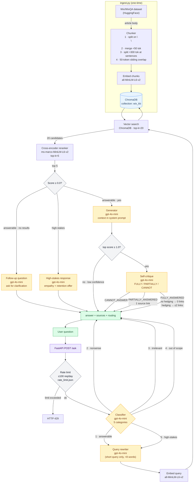

# RAG Support Assistant

A RAG (Retrieval-Augmented Generation) pipeline over the [Wix Help Center dataset](https://huggingface.co/datasets/Wix/WixQA). Built from scratch — no LangChain or LlamaIndex.

## Stack

| Layer | Tech |
|---|---|
| Dataset | `Wix/WixQA` via HuggingFace `datasets` |
| Chunking | Paragraph split + merge/split heuristics + 50-token sliding overlap |
| Embedding | `sentence-transformers` `all-MiniLM-L6-v2` |
| Vector store | ChromaDB (persistent, local) |
| Reranker | `cross-encoder/ms-marco-MiniLM-L6-v2` |
| LLM | OpenAI `gpt-4o-mini` via `pydantic-ai` (structured outputs) |
| API | FastAPI + CORS + static file serving |
| Frontend | Vanilla HTML/CSS/JS chat widget |
| Observability | Langfuse (traces + prompt versioning) |

## Setup

```bash
# Create venv and install dependencies
uv venv && uv sync

# Set environment variables
cp .env.example .env
# Fill in OPENAI_API_KEY and optionally LANGFUSE_* keys

# Ingest the dataset (one-time, idempotent)
uv run python src/ingest.py

# Register prompts with Langfuse (run once, or after any prompt edit)
uv run python prompts/seed.py

# Start the API + frontend
uv run uvicorn api.main:app --reload
# Visit http://localhost:8000
```

## Environment Variables

| Variable | Required | Description |
|---|---|---|
| `OPENAI_API_KEY` | Yes | OpenAI API key |
| `LANGFUSE_PUBLIC_KEY` | No | Langfuse public key for tracing |
| `LANGFUSE_SECRET_KEY` | No | Langfuse secret key for tracing |
| `LANGFUSE_HOST` | No | Langfuse host (defaults to cloud) |

Tracing and prompt versioning degrade gracefully if Langfuse keys are not set — the pipeline falls back to local prompt files.

## API

**Health check:**
```bash
curl http://localhost:8000/health
```

**Ask a question:**
```bash
curl -X POST http://localhost:8000/ask \
  -H "Content-Type: application/json" \
  -d '{"question": "How do I connect a custom domain to my Wix site?"}'
```

Response:
```json
{
  "answer": "To connect a custom domain...",
  "sources": ["Connecting a Domain to Your Wix Site"],
  "routing": "answered"
}
```

**Rate limit:** 100 requests per day. Returns HTTP 429 when exceeded.

**`routing` field values:**

| Value | Meaning |
|---|---|
| `answered` | Full pipeline ran; answer grounded in retrieved content |
| `followup` | Retrieval found nothing; bot asks a clarifying question |
| `low_confidence` | Reranker scores too low; answer shown but no sources, clarification requested |
| `cannot_answer` | Self-critique determined context cannot answer the question; connect-agent button shown |
| `high_stakes` | Cancellation / dispute / complaint; empathetic response + escalation offer |
| `out_of_scope` | Wix-related but beyond assistant scope; escalation offered |
| `irrelevant` | Off-topic question; suggestions shown |
| `nonsense` | No discernible intent; suggestions shown |

## Evaluation

```bash
uv run python eval/evaluate.py
```

Runs 10 Wix-domain Q&A pairs through the pipeline and scores each answer by keyword overlap. Results written to `eval/results.json`.

## Project Structure

```
src/
  ingest.py          # Dataset loading, chunking, ChromaDB population
  retriever.py       # Query embedding + vector search (top-20 candidates)
  reranker.py        # Cross-encoder reranking → top-5 chunks
  classifier.py      # 5-category query classifier (pydantic-ai)
  query_rewriter.py  # Query expansion for short queries (<8 words)
  generator.py       # Answer generation, self-critique, source link logic
  pipeline.py        # Orchestrates the full request pipeline
  rate_limit.py      # Daily 100-request cap (rate_limit.json)
  prompts.py         # Langfuse prompt fetching + OTel prompt linkage
prompts/
  *.txt              # Prompt source files (version-controlled)
  seed.py            # Registers prompts with Langfuse
api/
  main.py            # FastAPI app with CORS and static file mount
frontend/
  index.html         # Mock SaaS dashboard + chat widget
  style.css          # All styles (CSS variables, no framework)
  main.js            # Widget logic, markdown rendering, routing handlers
eval/
  evaluate.py        # 10 Q&A pairs, keyword scoring
chroma_db/           # Persisted vector store (created on first ingest)
```

## Pipeline



## Notes

- **Chunking**: Articles are split on `\n\n`, short paragraphs (<50 tokens) are merged with neighbors, long chunks (>300 tokens) are split at sentence boundaries targeting ~200 tokens, then a 50-token overlap is prepended to each subsequent chunk.
- **Idempotency**: Re-running `ingest.py` skips population if the ChromaDB collection already contains documents.
- **Prompt versioning**: Prompts live in `prompts/*.txt` and are registered with Langfuse via `prompts/seed.py`. The pipeline fetches the `production`-labelled version at runtime with a local fallback if Langfuse is unreachable.
- **Self-critique**: After generating an answer, a second LLM call assesses whether the context fully, partially, or cannot answer the question. This drives source link inclusion rather than a binary faithfulness caveat.
- **Architecture decisions**: See [`ARCHITECTURE.md`](./ARCHITECTURE.md) for detailed reasoning behind every design choice and a full production readiness breakdown.
