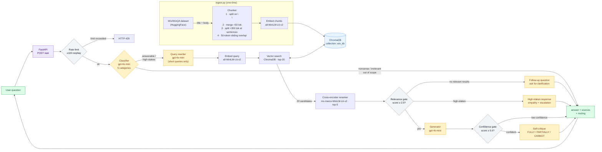

# RAG Support Assistant

A customer support RAG pipeline built over the [Wix Help Center dataset](https://huggingface.co/datasets/Wix/WixQA). Every stage — chunking, retrieval, reranking, classification, generation, and evaluation — is implemented from scratch so the design decisions are visible and auditable.

The focus is on what happens when the pipeline *can't* confidently answer: when retrieval returns nothing useful, when the model hedges, or when the user is upset and asking to cancel their account. Each of these cases has a specific, designed response path rather than a generic fallback.

In a support context, these failure cases are where the business impact lives. A bot that handles a cancellation request the same way it handles a how-to question will lose that customer. A bot that confidently presents a wrong answer erodes trust faster than having no bot at all. And a bot that says "I don't know" with no next step is a dead end that drives a support ticket anyway. The failure handling in this pipeline is designed to deflect tickets when the bot can help, preserve trust when it can't, and route to a human immediately when the situation calls for it.

## Limitations

- **No multi-turn conversation.** The pipeline is completely stateless — each request is independent with no memory of previous messages. For a production support bot, conversation context is table stakes (follow-up questions, pronoun resolution, etc.). This is a deliberate scope boundary for the demo; the architecture would need a session store and context window to support it.
- **Connect-to-agent is a demo stub.** The agent handoff flow shows mock team availability but does not actually connect to a live agent. In production this would integrate with a live chat system.
- **No adversarial input protection.** The pipeline does no prompt injection filtering or input sanitization beyond what the LLM provider applies. A malicious user could craft inputs to manipulate classifier routing or generation output. Production deployment would need an input guardrail layer before the classifier.

## How it works

Here's what a user sees when they ask a question:

1. **Got an answer** — the bot replies with a grounded answer and links to the source help articles. If the answer only partially covers the question, the bot says so and offers a soft link to talk to a human instead of pretending it nailed it.
2. **Got asked a follow-up** — the bot couldn't find anything relevant in the knowledge base, so instead of guessing, it asks a clarifying question to keep the conversation going.
3. **Got connected to an agent** — the user asked something sensitive (cancellation, billing dispute) or the bot determined it genuinely can't help. The user sees an empathetic message and a button to reach a support agent, not a generic "I don't know."

Under the hood, every question is classified into one of five categories — **answerable**, **nonsense**, **irrelevant**, **out-of-scope**, or **high-stakes** — and routed to a purpose-built handler. Only answerable and high-stakes queries go through retrieval; the rest get static responses immediately without wasting compute.

For queries that go through retrieval, the pipeline applies two confidence gates before presenting an answer:

1. **Relevance gate** — if the cross-encoder reranker's top score is below 2.0, the retrieved results aren't good enough. Instead of generating from weak context, the bot asks a clarifying follow-up question.
2. **Confidence gate** — if the top score is below 5.0, the answer is shown but the bot signals that it isn't fully sure and asks the user to be more specific.

After generation, a **self-critique** step assesses whether the answer fully, partially, or cannot address the question. This determines whether to offer human escalation and how much confidence to convey to the user.

**High-stakes queries** (cancellations, billing disputes, complaints) bypass normal generation entirely. They get an empathetic acknowledgment with a structured retention offer and escalation path — because a standard RAG answer to "I want to cancel my account" is the wrong response.

## Latency

The full pipeline for an answerable query takes **~6–12 seconds** end-to-end, averaging around 9 seconds. Almost all of that is LLM calls — local compute (embedding, reranking) is under 250ms after model warmup.

| Stage | Time | Notes |
|---|---|---|
| Classify | ~1.3s | Every query pays this |
| Query rewrite | ~2s | Only short queries (<8 words) |
| Retrieve + rerank | ~0.3s | Local models, fast after warmup |
| Generate | ~5s | Longest single call |
| Self-critique | ~1.5s | Only runs when confidence is high enough to cite sources |

The cost is in the sequential LLM chain. An answerable query makes 3–4 LLM calls in sequence: classify → (rewrite) → generate → self-critique. Each call depends on the output of the previous one — classification determines whether to retrieve at all, generation produces the text that self-critique evaluates — so they cannot be parallelized. This is different from a pipeline where multiple independent checks run on the same input, which could run concurrently. Here, each step genuinely needs the previous step's output before it can start.

That's a real tradeoff. Whether 9 seconds is acceptable depends entirely on the product context. A search autocomplete can't afford a single extra LLM call. But in a support context, a wrong answer or a tone-deaf response to a frustrated user costs more than a few extra seconds of wait time — users who are stuck on a billing issue or trying to set up a domain are willing to wait longer for a good answer than they would for a quick-and-wrong one.

The pipeline prioritizes response quality over speed: the classifier prevents wasted retrieval on nonsense, the self-critique catches answers that look plausible but don't actually address the question, and the confidence gate prevents the bot from confidently citing articles it shouldn't. Each of those calls earns its latency. But the cumulative cost is real, and production would need to address it — streaming the answer to the user while self-critique runs in the background, swapping the classifier for a fine-tuned model that runs locally in <50ms, or running independent checks concurrently where the dependency graph allows it.

## Failure states

| Situation | Response | Reasoning |
|---|---|---|
| Retrieval finds nothing relevant | Clarifying follow-up question | Avoids hallucinating from weak context; keeps the conversation going |
| Low retrieval confidence (score 2.0–5.0) | A disclaimer appears above the answer ("I'm not fully sure this matches what you're asking…") and no source links are shown | The context is good enough to attempt an answer but not good enough to cite confidently — the disclaimer is rendered as a visually distinct element above the answer bubble so the user reads everything that follows with the right expectations |
| Self-critique: CANNOT_ANSWER | "I couldn't find an answer" + connect-to-agent button | Immediate escalation path instead of a vague hedge |
| Self-critique: PARTIALLY_ANSWERED | Answer + 1 source link (labeled "Related article") + soft inline escalation link ("Need more detail? Talk to a support agent") | Partial answers are still useful — a prominent connect-agent button would push escalation too hard, but a soft text link gives the user an easy path if the answer isn't enough |
| Self-critique: FULLY_ANSWERED | Answer + up to 2 source links | Confident answer with "read more" links to the full articles |
| High-stakes query | Empathetic acknowledgment + retention offer + escalation | Sensitive queries need tone and structure control, not a help article |
| Out-of-scope query | Escalation offer | Doesn't pretend to help with things it can't handle |
| Nonsense or irrelevant query | Polite deflection + topic suggestions | Saves retrieval and generation compute |
| Rate limit exceeded | HTTP 429, "try again tomorrow" in the widget | Prevents runaway API cost |

These are implemented in [`src/pipeline.py`](src/pipeline.py) and [`src/generator.py`](src/generator.py). The frontend ([`frontend/main.js`](frontend/main.js)) renders each routing state differently — source pills, connect-agent buttons, suggestion chips.

## Evaluation

The bot finds the right help article about 7 times out of 10, and when it does generate an answer, that answer is almost always grounded in the retrieved content rather than hallucinated.

The pipeline is evaluated against the [WixQA benchmark](https://huggingface.co/datasets/Wix/WixQA) with retrieval and generation scored separately, so failures can be diagnosed to the right stage. I ran 7 experiments across retrieval strategy, query expansion, classifier tuning, and chunk enrichment. The best configuration is **title-prepended embeddings + cross-encoder reranking**.

| Metric | Score | What it means |
|---|---|---|
| Expert Hit Rate @ 5 | **0.71** *(n=200)* | "Did the right article show up?" — 71% of the time, the correct help article appeared in the top 5 results when tested against human-written questions with known answers |
| Expert MRR | **0.51** *(n=200)* | "How high did it rank?" — on average, the correct article appeared around position 2. Higher is better (1.0 = always first) |
| Faithfulness | **4.80 / 5** *(n=50)* | "Did the bot make things up?" — an LLM judge scored how well answers stuck to the retrieved content. 4.8/5 means answers are almost entirely grounded, not hallucinated |
| Relevancy | **4.76 / 5** *(n=50)* | "Did the bot actually answer the question?" — an LLM judge scored whether the response addressed what was asked. 4.76/5 means answers are consistently on-topic |

Sample sizes are sufficient to compare configurations and identify failure patterns, but too small for tight confidence intervals — individual values could shift ±0.05 with a different sample.

The expert hit rate ceiling at 0.71 is a genuine finding: the remaining 29% are KB coverage gaps and vocabulary mismatches that persisted across all seven experiments, including approaches I tried and reverted (HyDE, always-on query expansion, larger candidate pools). The most impactful next steps would be hybrid retrieval (dense + BM25) and a larger embedding model.

Details: [experiment log](eval/EXPERIMENTS.md) and [evaluation methodology](eval/README.md).

## Pipeline



## Stack

| Layer | Tech | What it does |
|---|---|---|
| Chunking | Paragraph split + merge/split heuristics + 50-token overlap | Breaks help articles into retrievable pieces while preserving natural structure |
| Embedding | `sentence-transformers/all-MiniLM-L6-v2` (local) | Converts text to vectors for similarity search, runs locally with no API cost |
| Vector store | ChromaDB (persistent, local) | Stores and searches article chunks by similarity, zero infrastructure to set up |
| Reranker | `cross-encoder/ms-marco-MiniLM-L6-v2` | Two-pass search: fast scan of all articles, then precise re-scoring of top candidates so the right answer surfaces even when the user's phrasing doesn't match the article's wording |
| LLM | OpenAI `gpt-4o-mini` via `pydantic-ai` | Generates answers, classifies queries, and self-critiques responses with structured output |
| API | FastAPI + CORS + static files | Serves the pipeline and frontend; preloads models at startup to eliminate cold-start delays |
| Frontend | Vanilla HTML/CSS/JS chat widget | Renders each response type differently: source links, escalation buttons, suggestion chips |
| Observability | Langfuse (traces + prompt versioning) | Shows exactly what happened on every request; prompts can be updated without code changes |

**Key design decisions** (detailed reasoning in [ARCHITECTURE.md](ARCHITECTURE.md)):
- **No framework** — every pipeline stage is written explicitly so the design decisions are visible and debuggable, not hidden behind abstractions
- **Two-stage retrieval** — fast vector search for recall, then a cross-encoder reranker for precision; this was the single largest quality improvement in evaluation
- **Self-critique over generic caveats** — a structured LLM assessment (FULLY / PARTIALLY / CANNOT) drives specific UI behavior rather than appending "please verify" to every answer

## What changes for production

| Area | Demo | Production |
|---|---|---|
| Vector store | ChromaDB (local file) | pgvector or managed service (Pinecone, Qdrant) |
| Retrieval | Dense only | Hybrid: dense + BM25 with RRF |
| Embeddings | Local `all-MiniLM-L6-v2` | Embedding API or domain-adapted model |
| Query expansion | 8-word gated rewriter | Selective expansion based on learned heuristics |
| Classification | LLM call (gpt-4o-mini) | Fine-tuned small classifier, <50 ms |
| Evaluation | Offline script, LLM-as-judge on 50 questions | CI-gated regression suite on prompt/retrieval changes |
| Rate limiting | JSON file | Redis `INCR` + `EXPIRE`, per-user |
| Prompt caching | Process lifetime | TTL-based (60–300 s), A/B tested via Langfuse datasets |
| Agent init | Lazy, per-module | Startup lifespan event, shared across workers |
| High-stakes | Fictional retention, mock queue | CRM-driven offers, real ticketing / live chat integration |
| Conversation context | Stateless (single turn) | Sliding window stored in Redis, session ID on API |
| Streaming | None | Server-Sent Events, token-by-token |
| Frontend | Vanilla JS widget | React + TypeScript |
| Auth | None | API key or OAuth, per-user quotas |
| Observability | Langfuse traces | Langfuse + structured logging + latency metrics per stage |

<details>
<summary><strong>Setup, API, project structure, and environment variables</strong></summary>

## Setup

```bash
# Create venv and install dependencies
uv venv && uv sync

# Set environment variables
cp .env.example .env
# Fill in OPENAI_API_KEY (required) and optionally LANGFUSE_* keys

# Ingest the dataset (one-time, idempotent — skips if already populated)
uv run python src/ingest.py

# Register prompts with Langfuse (optional — run once, or after any prompt edit)
uv run python prompts/seed.py

# Start the API + frontend
uv run uvicorn api.main:app --reload
# Visit http://localhost:8000
```

## API

```bash
# Health check
curl http://localhost:8000/health

# Ask a question
curl -X POST http://localhost:8000/ask \
  -H "Content-Type: application/json" \
  -d '{"question": "How do I connect a custom domain to my Wix site?"}'
```

Response:
```json
{
  "answer": "To connect a custom domain...",
  "sources": ["Connecting a Domain to Your Wix Site"],
  "routing": "answered"
}
```

The `routing` field tells the frontend how to render the response:

| Value | Meaning |
|---|---|
| `answered` | Full pipeline ran; answer grounded in retrieved content |
| `partially_answered` | Self-critique found a partial answer; 1 source link + soft escalation link |
| `followup` | Retrieval found nothing useful; bot asks a clarifying question |
| `low_confidence` | Reranker scores too low; disclaimer shown above answer, no sources |
| `cannot_answer` | Self-critique determined context can't answer; escalation offered |
| `high_stakes` | Cancellation/dispute/complaint; empathetic response + escalation |
| `out_of_scope` | Beyond assistant scope; escalation offered |
| `irrelevant` | Off-topic; topic suggestions shown |
| `nonsense` | No discernible intent; topic suggestions shown |

## Project structure

```
src/
  ingest.py          # Dataset loading, chunking, ChromaDB population
  retriever.py       # Query embedding + vector search (top-20 candidates)
  reranker.py        # Cross-encoder reranking → top-5 chunks
  classifier.py      # 5-category query classifier (pydantic-ai)
  query_rewriter.py  # Query expansion for short queries (<8 words)
  generator.py       # Answer generation, self-critique, confidence signaling
  pipeline.py        # Orchestrates the full request pipeline
  rate_limit.py      # Daily 100-request cap (rate_limit.json)
  prompts.py         # Langfuse prompt fetching + OTel prompt linkage
prompts/
  *.txt              # Prompt source files (version-controlled)
  seed.py            # Registers prompts with Langfuse
api/
  main.py            # FastAPI app with CORS and static file mount
frontend/
  index.html         # Mock SaaS dashboard + chat widget
  style.css          # All styles (CSS variables, no framework)
  main.js            # Widget logic, markdown rendering, routing handlers
eval/
  evaluate.py        # Retrieval + generation evaluation against WixQA benchmark
  EXPERIMENTS.md     # Full experiment log with results and root cause analysis
  README.md          # Evaluation methodology and metric definitions
tests/
  test_chunking.py   # Chunking pipeline unit tests
  test_generator.py  # Generator helpers and source link logic tests
  test_pipeline.py   # Routing decision tests (mocked LLM calls)
  test_metrics.py    # Evaluation metric function tests
```

## Environment variables

| Variable | Required | Description |
|---|---|---|
| `OPENAI_API_KEY` | Yes | OpenAI API key |
| `LANGFUSE_PUBLIC_KEY` | No | Langfuse public key for tracing |
| `LANGFUSE_SECRET_KEY` | No | Langfuse secret key for tracing |
| `LANGFUSE_HOST` | No | Langfuse host (defaults to cloud) |

Tracing and prompt versioning degrade gracefully if Langfuse keys are not set — the pipeline falls back to local prompt files.

</details>

## Further reading

- **[ARCHITECTURE.md](ARCHITECTURE.md)** — reasoning behind every technical decision, what evaluation revealed about each choice, and what would change for production
- **[eval/EXPERIMENTS.md](eval/EXPERIMENTS.md)** — full experiment log: 7 experiments with results, root cause analysis, and detailed failure breakdowns for approaches that were tried and reverted
- **[eval/README.md](eval/README.md)** — evaluation methodology, metric definitions, and known limitations of LLM-as-judge scoring
